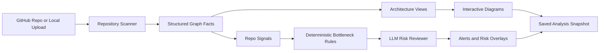

# DynoDocs

DynoDocs is an AI-powered architecture intelligence platform that turns a repository into a living system map.

Instead of forcing engineers to reverse-engineer a codebase from source files, stale docs, and tribal knowledge, DynoDocs ingests a repository, infers its structure, generates multiple architecture views, animates request flow, and highlights likely bottlenecks before they become painful production surprises.

## Why This Matters

Modern systems are hard to understand because architecture knowledge is scattered:

- across code
- across config
- across infrastructure files
- across undocumented integrations
- and inside the heads of a few experienced engineers

That causes real problems:

- onboarding is slow
- debugging lacks system-wide visibility
- architecture reviews become guesswork
- documentation goes stale quickly
- tribal knowledge becomes a bottleneck

DynoDocs is built to solve exactly that.

## What DynoDocs Does

Given a GitHub repository or an uploaded local project, DynoDocs:

1. scans the codebase and configuration
2. infers services, APIs, data stores, caches, messaging, and integrations
3. builds a structured architecture graph
4. generates four interactive architecture views
5. animates request and data flow through the system
6. overlays static bottleneck and fragility risks as alerts
7. saves the analysis snapshot so teams can revisit it instantly

## The Four Architecture Views

DynoDocs presents the same system through four complementary lenses:

- `System Context`
  Shows the system in its environment: users, external actors, partner systems, and boundaries.

- `Conceptual`
  Shows the business-level capabilities and major domains the application is organized around.

- `Component`
  Shows the internal technical structure: frontend, API, services, caches, databases, and external integrations.

- `Operational`
  Shows how the system is deployed and operated: ingress, infrastructure, runtime services, and supporting resources.

## What Makes It AI-Powered

DynoDocs is not just a static diagram generator. It combines deterministic analysis with AI interpretation.

### 1. Code-aware extraction

The platform scans:

- source code
- routes and handlers
- HTTP client usage
- database access patterns
- cache usage
- queue and infrastructure config
- deployment and orchestration files

This produces structured architecture facts instead of vague keyword matches.

### 2. Architecture graph synthesis

Those extracted facts are normalized into a graph of:

- nodes
- edges
- APIs
- evidence
- repository signals

This becomes the source of truth for downstream reasoning.

### 3. Hybrid AI diagram generation

DynoDocs uses a hybrid pipeline where deterministic graph facts establish the structure, and LLM-powered generation improves explanation, grouping, and presentation.

That means the AI is used to make the system understandable, not to hallucinate architecture from scratch.

### 4. Evidence-backed bottleneck detection

DynoDocs also runs a static bottleneck detector that looks for structural risks such as:

- long synchronous call chains
- missing timeouts around external requests
- N+1-style database access
- missing pagination
- blocking I/O in request paths
- shared database hotspots
- cache stampede risk
- unbounded queues or missing DLQ-style safeguards

An LLM reviewer then helps:

- explain why the pattern matters
- improve readability of the finding
- group related risks
- suggest what the developer should inspect first

Critically, the system is designed so the LLM does not invent production incidents. DynoDocs positions these as static architecture risks, not confirmed runtime failures.

## How It Works



## Core Product Experience

### Authentication and repository access

Users sign in and connect DynoDocs to their workspace. The app can then pull in repositories a user already works with, reducing friction at the start of analysis.

### Repository ingestion

DynoDocs supports two primary input modes:

- GitHub repository analysis
- local project upload and analysis

### Interactive architecture exploration

Once analysis is complete, users can move across the four diagram perspectives without manually creating a single box or arrow.

### Animated request flow

The UI visualizes how requests and data move across the system, helping teams understand architecture behavior rather than just static structure.

### Alerts

DynoDocs surfaces architecture alerts derived from static analysis, including severity and evidence-backed explanations.

### Team understanding

The platform is designed to support shared system understanding across engineers, not just a one-time diagram export.

## Why DynoDocs Is Compelling

DynoDocs sits at the intersection of:

- software architecture
- developer tooling
- AI-assisted reasoning
- onboarding and debugging productivity

What makes it compelling is that it does not just summarize code. It transforms a codebase into a navigable system model that helps teams answer high-value questions quickly:

- What are the major parts of this system?
- How do requests move through it?
- What external systems does it depend on?
- Where are the likely fragility points?
- What should an engineer inspect first?

## Current Scope

DynoDocs currently focuses on static architecture intelligence.

That means it can say:

- this code path may become a bottleneck
- this dependency chain looks fragile
- this request path appears to rely on an external provider

It does not claim:

- actual production latency
- actual CPU saturation
- actual queue backlog
- actual database lock contention

Without telemetry, DynoDocs stays honest. It provides evidence-backed architectural risk signals, not fake observability.

## Tech Stack

### Frontend

- Next.js
- TypeScript
- Tailwind CSS
- Motion
- Supabase authentication

### Backend

- FastAPI
- SQLAlchemy
- Redis caching
- repository analyzers and graph builders
- deterministic bottleneck rules
- LLM-assisted diagram and risk explanation pipeline

## Repository Structure

```text
app/api    FastAPI backend, analyzers, graph pipeline, bottleneck engine
app/web    Next.js frontend and interactive architecture UI
infra      infrastructure-related assets and deployment support
cli        command-line and helper tooling
```

## Vision

DynoDocs aims to make architecture understanding:

- faster for new engineers
- clearer for reviewers and stakeholders
- more actionable for debugging
- more durable than manual documentation

In short: DynoDocs helps teams see their system, not just their code.
